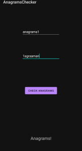

# Random apps

- ##### This is a repository with random android apps.
- ##### I don't know if this repository will be updated in the future, maybe or maybe not
- ##### I was needed to relearn some android development, so i said the best way to do this is to make some apps
- ##### Now this repo is extended with a Flutter app, i did this app to learn Flutter

## Apps that are in this repo

1. AnagramChecker

    - An app that takes 2 texts and print if them are anagram or not
    - Use: 
        * PlainText
        * TextView
        * Button

2. Timer

    - A simple timer app
    - Use: 
        * TextView
        * SeekBar
        * Button
        * CountDownTimer

3. BooleanAlgebra

    - A app that can do simple boolean algebra operations
    - Use: 
        * TextView
        * CheckBox
        * Spinner
        * Button
        * Kotlin extension to a built-in class

4. MathQuiz

    - An app that gives you math quizes and you need to resolve them to get points
    - Use: 
        * TextView
        * SeekBar(Discrete)
        * Button
        * Number(Signed)
        * CountDownTimer
        * Toast

5. Xand0

    - An app for playing unlimited rounds of X and 0
    - Use:
        * Flutter
        * Dart
        * Async programming
